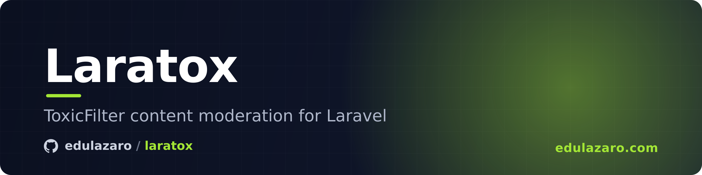

# Laratox

Content moderation for Laravel, powered by [ToxicFilter](https://toxicfilter.com).

Every check returns one of three decisions (`allow`, `review`, `block`), the categories that fired (spam, scams, harassment, personal data… fifteen in all) and the reason in words.

## Installation

Requires PHP 8.2+ and Laravel 12 or 13.

```bash
composer require edulazaro/laratox
```

Create a key in your [ToxicFilter account](https://toxicfilter.com/register) (the free plan
is enough) and add it to `.env`:

```env
TOXICFILTER_KEY=tf_test_...
```

A `tf_test_` key does the same work and is never charged. Check it with:

```bash
php artisan laratox:ping
```

## Checking content

Say what it is, then `check()`:

```php
use ToxicFilter;

$verdict = ToxicFilter::text($comment->body)->check();

if ($verdict->blocked()) {
    return back()->withErrors(['body' => $verdict->reason()]);
}

$comment->hidden = $verdict->needsReview();
```

Options chain before `check()`:

```php
ToxicFilter::text($listing->description)
    ->policy('marketplace')     // one of your policies, instead of the default
    ->locale('es')              // the language it should be in
    ->surface('listing')        // where it appears
    ->reference("listing_{$listing->id}")
    ->check();
```

Also `->actor()`, `->withoutAi()`, `->rules([...])`, `->redact()` and `->option($key, $value)` for anything else.

Every kind of content:

```php
ToxicFilter::text($body)->check();
ToxicFilter::name($user->username)->check();
ToxicFilter::email($request->email)->check();
ToxicFilter::url($request->website)->check();
ToxicFilter::image($photo->url)->check();
ToxicFilter::imageData($upload->get())->check();
ToxicFilter::prompt($question)->check();
ToxicFilter::conversation($messages)->check();
ToxicFilter::signup(['name' => $name, 'email' => $email, 'bio' => $bio])->check();
```

The verdict is the [PHP SDK](https://github.com/toxicfilter/php-sdk)'s: `allowed()`, `needsReview()`, `blocked()`, `reason()` (the first one), `reasons()` (all of them), `scores()`, `flagged()`, `id()`… The rest of the API is there too: `ToxicFilter::batch()`, `records()`, `resolve()`, `feedback()`, `usage()`, `ping()`, and `ToxicFilter::client()` gives you the SDK client itself.

## When the API cannot answer

`check()` throws the SDK's exceptions. Catch the ones you want to handle:

```php
use ToxicFilter\Exception\ApiError;
use ToxicFilter\Exception\QuotaExhausted;

try {
    $verdict = ToxicFilter::text($comment->body)->check();
} catch (QuotaExhausted $e) {
    // Out of credits: $e->remaining(), $e->required(), $e->renewsAt().
} catch (ApiError $e) {
    // Down, wrong key, or a rejected field: $e->status, $e->getMessage().
}
```

| Exception | When |
|---|---|
| `AuthenticationError` | The key is wrong |
| `QuotaExhausted` | Not enough credits for this call |
| `InvalidRequest` | A field was rejected: `$e->fields()` |
| `RateLimited` | Too many calls, after the retries |
| `ServerError` | The service is down or unreachable, after the retries |

All of them extend `ToxicFilter\Exception\ApiError`. The validation rule below catches them for you.

## In a form

```php
use EduLazaro\Laratox\Rules\Moderated;

$request->validate([
    'body' => ['bail', 'required', 'string', Moderated::text()->policy('comments')],
    'website' => ['bail', 'nullable', 'url', Moderated::url()],
]);
```

The rule chains the same options as `ToxicFilter::text()`. A `block` fails the field; a
`review` passes, and `->orReview()` fails it too. Put the rule last, after `bail`, since it
is a network call.

The message carries ToxicFilter's reason: *"The body could not be accepted: contains a phone
number."* Reasons are written in English, so by default (`rule.show_reason` = `auto`) they are
only shown when your app's locale is English; other languages get the message without one.

To act on the decision afterwards, keep the rule:

```php
$rule = Moderated::text();

$request->validate(['body' => ['required', $rule]]);

$comment->hidden = $rule->verdict()?->needsReview() ?? false;
```

With a wildcard (`'tags.*' => [$rule]`), ask for each field: `$rule->verdict('tags.0')`.

If the API cannot answer, `laratox.rule.on_error` decides: `allow` (default) lets the field
through and logs a warning, `refuse` fails it.

## Testing

```php
$fake = ToxicFilter::fake();                                  // everything allowed

$fake->shouldBlock('spam', 'Contains a referral link');       // block everything
$fake->shouldReview('toxicity', when: fn ($request) =>        // or only some requests
    str_contains($request['body']['content'] ?? '', 'idiot'));

$fake->assertSent(fn ($request) => $request['path'] === '/api/v1/text');
$fake->assertSentCount(1);
```

The fake replaces only the network: the SDK's client and verdicts are the real ones.

## Configuration

```bash
php artisan vendor:publish --tag=laratox-config
```

| Key | Env | Default |
|---|---|---|
| `key` | `TOXICFILTER_KEY` | |
| `url` | `TOXICFILTER_URL` | `https://toxicfilter.com` |
| `timeout` | `TOXICFILTER_TIMEOUT` | `10` |
| `connect_timeout` | `TOXICFILTER_CONNECT_TIMEOUT` | `5` |
| `retries` | `TOXICFILTER_RETRIES` | `2` |
| `rule.on_error` | `TOXICFILTER_ON_ERROR` | `allow` |
| `rule.show_reason` | | `auto` (`true`, `false`, or only when the locale is English) |

Calls go through Laravel's HTTP client, so `Http::fake()` and your logging see them. A 429 or 5xx is retried with the same idempotency key, so it is judged and billed once; a 402 is never retried.

## Sponsors

Laratox is supported by the following sponsors. Thank you for keeping it growing:

<p>
  <a href="https://kenodo.com"></a>&nbsp;<a href="https://kenodo.com">Kenodo</a>&nbsp;&nbsp;&nbsp;&nbsp;
  <a href="https://andorradev.com"></a>&nbsp;<a href="https://andorradev.com">AndorraDev</a>
</p>

## Author

Created by [Edu Lazaro](https://edulazaro.com)

## License

Laratox is open-sourced software licensed under the [MIT license](LICENSE).
